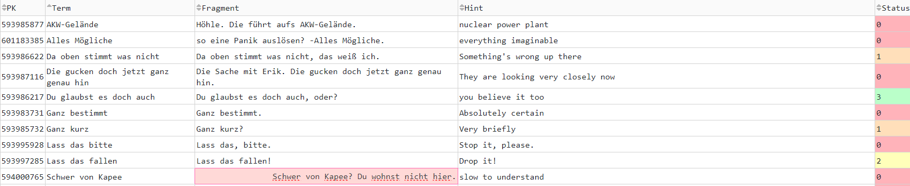

## LingQ Updater

[LingQ](https://www.lingq.com) is a popular language learning application. One very useful component of it is the option to import external material, e.g. Netflix shows, YouTube videos, etc., and create "LingQs" (essentially flashcards) as you watch or listen alongside the material.

While LingQ is a great platform, it has some quirkiness. Namely, when a LingQ is created from some source material, the context it was used in is added to the card as an example of usage. However, especially in imported material, sometimes that context is something very useless: the end of a longer sentence, a quote taken out of context, or even a sound effect (`[doorbell rings]`). To make matters worse, there is no way to edit this context (called a "fragment") in the UI or in the mobile app.

Thankfully, LingQ does offer an API that can be used to perform all or most of the same actions that can be done from the UI, plus some others. Most importantly, fields that are not editable in the UI can be updated via API.

This is a very simple web application that will grab your LingQs, display them in the browser, and allow you to double-click the `Fragment` cell and edit it.

## Installation

1. Install requirements: `pip install -r requirements.txt`
1. Copy `config.ini.txt` to `config.ini` and either add your username and password, or fetch your API key directly from `https://www.lingq.com/en/accounts/apikey/` and insert it in the config. _Do not wrap any of the values in quotes._
1. Run the frontend: `python frontend.py`
1. Navigate to `http://localhost:8050`

Double click in any `Fragment` cell to update the value. Once double-clicked, you can use the arrow keys to show a cursor.

## Screenshots

## Acknowledgements

This was hastily cobbled together with the help of a few different sources:

- ChatGPT
- [CiaranCurran/auto-sync-lingq](https://github.com/CiaranCurran/auto-sync-lingq/tree/main/sync_lingq)
- [thags/lingqAnkiSync](https://github.com/thags/lingqAnkiSync/tree/main)
